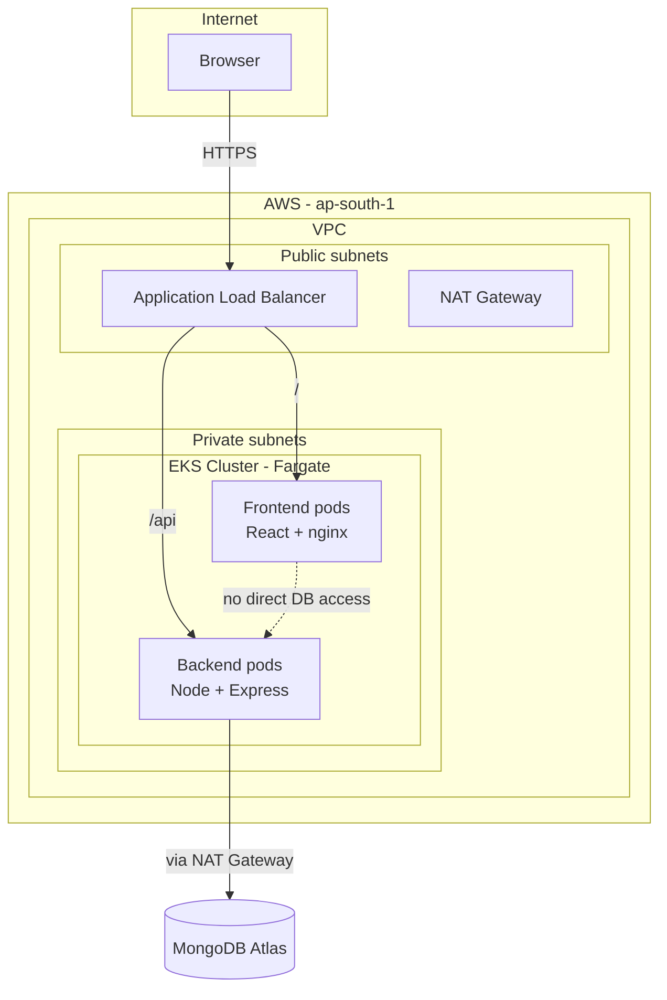

# MERN Blog on AWS EKS (Fargate)

A production-style deployment of a MERN stack blog application on Amazon EKS, provisioned entirely with Terraform and deployed via automated, OIDC-authenticated CI/CD pipelines — no long-lived AWS credentials anywhere in the pipeline.

## Architecture



The frontend and backend run as separate Deployments on **AWS Fargate** (no EC2 worker nodes to patch or manage), exposed through a single **Application Load Balancer** provisioned automatically by the AWS Load Balancer Controller reading Kubernetes `Ingress` resources. The backend reaches **MongoDB Atlas** over the public internet via a NAT Gateway, since EKS Fargate profiles require private subnets.

## Tech stack

| Layer | Technology |
|---|---|
| Frontend | React (Vite), served by nginx |
| Backend | Node.js, Express |
| Database | MongoDB Atlas (managed, external) |
| Container runtime | Docker, images hosted on Docker Hub |
| Orchestration | Kubernetes on Amazon EKS (Fargate — serverless, no managed node groups) |
| Package management | Helm (two independent charts — frontend, backend) |
| Infrastructure as Code | Terraform (VPC, EKS cluster, Fargate profiles, IAM, OIDC) |
| CI/CD | GitHub Actions, split into independent frontend/backend/infra pipelines |
| Ingress / Load Balancing | AWS Load Balancer Controller → Application Load Balancer |
| Authentication (CI → AWS) | OpenID Connect (OIDC) federation — zero static AWS keys |

## Key design decisions

**No long-lived AWS credentials.** GitHub Actions authenticates to AWS using short-lived, per-run credentials via OIDC federation (`sts:AssumeRoleWithWebIdentity`), rather than storing an AWS access key as a repository secret. Each workflow run gets a fresh, minutes-long token — nothing persists to leak.

**Least-privilege, single-purpose IAM roles.** Rather than one shared role, each actor gets its own narrowly-scoped role:
- `github-actions-terraform` — broad infra-provisioning permissions, used only by the infrequent infra pipeline
- `github-actions-eks-deploy` — scoped to `eks:DescribeCluster` plus Kubernetes RBAC access via an EKS Access Entry; used by the frequent app-deploy pipelines
- `eks-lb-controller-role` — IRSA-linked role used only by the AWS Load Balancer Controller pod to manage ALBs

**Two authorization layers, kept distinct.** AWS IAM governs what a caller can do against AWS APIs; Kubernetes RBAC (via EKS Access Entries) separately governs what that same identity can do inside the cluster. Neither implies the other.

**Independent CI/CD pipelines.** Frontend and backend are two separate Helm charts, deployed via two separate GitHub Actions workflows, each triggered only by changes to its own path (`frontend/**`, `backend/**`). A backend-only change never rebuilds or redeploys the frontend, and vice versa.

**Cost-conscious infrastructure.** A single NAT Gateway (not one per AZ), Fargate over EC2 node groups (pay per pod, no idle capacity), and no ECR (images hosted on Docker Hub instead) keep this project runnable for a few dollars per session rather than tens of dollars per month.

## Repository structure

```
.
├── frontend/                  # React app + Dockerfile
├── backend/                   # Express API + Dockerfile
├── helm/
│   ├── frontend/               # Helm chart: Deployment, Service, Ingress
│   └── backend/                 # Helm chart: Deployment, Service
├── terraform/
│   ├── vpc.tf                  # VPC, public + private subnets, NAT Gateway
│   ├── eks-cluster.tf           # EKS cluster + Fargate profiles
│   ├── access-entries.tf        # EKS Access Entries (IAM → K8s RBAC)
│   ├── vars.tf
│   ├── local.tf
│   ├── outputs.tf
│   ├── alb-controller-policy.json
│   └── data.tf
└── .github/
    └── workflows/
        ├── terraform.yml         # Infra pipeline (path-filtered, manual + on infra changes)
        ├── frontend-deploy.yml   # Build, push, deploy frontend
        └── backend-deploy.yml    # Build, push, deploy backend
```

## CI/CD pipeline flow

1. Push to `main` touching `frontend/**` or `backend/**` triggers the corresponding workflow
2. **Test** job runs (placeholder for real test suites)
3. **Build** job logs into Docker Hub, builds the image tagged with the commit SHA, pushes it
4. **Deploy** job:
   - Assumes an AWS IAM role via GitHub's OIDC token (no stored AWS keys)
   - Updates kubeconfig against the EKS cluster
   - Creates/updates the MongoDB connection secret (backend only), idempotently
   - Runs `helm upgrade --install`, overriding only the image tag for that service

Infrastructure changes (`terraform/**`) run through a separate, manually-triggerable pipeline — infra changes are far less frequent and higher-blast-radius than app deploys, so they're deliberately decoupled.

## Local development

```bash
# Backend
cd backend
cp .env.example .env   # fill in MONGODB_URI
npm install
npm run dev

# Frontend
cd frontend
npm install
npm run dev
```

## Deploying from scratch

```bash
# 1. Provision infrastructure
cd terraform
terraform init
terraform apply

# 2. Connect kubectl
aws eks update-kubeconfig --name <cluster-name> --region <region>

# 3. Patch CoreDNS to run on Fargate
kubectl patch deployment coredns -n kube-system --type json \
  -p '[{"op": "remove", "path": "/spec/template/metadata/annotations/eks.amazonaws.com~1compute-type"}]'

# 4. Install the AWS Load Balancer Controller (if not managed by Terraform)
helm install aws-load-balancer-controller eks/aws-load-balancer-controller -n kube-system ...

# 5. Push to main — GitHub Actions handles build + deploy from here
```

## Known trade-offs

- **NAT Gateway required, not optional.** EKS Fargate profiles only accept private subnets, so a NAT Gateway (single, to control cost) is required for outbound internet access — this was a specific, deliberate correction made after initially exploring a public-subnet-only design.
- **MongoDB Atlas IP allowlisting** uses the NAT Gateway's static Elastic IP, rather than a wide-open `0.0.0.0/0` rule.
- **No autoscaling (HPA) configured** — intentionally out of scope for a demo workload; a natural next step.
- **No custom domain / TLS** — the app is served over the raw ALB hostname; adding Route 53 + ACM is a straightforward extension.

## What this project demonstrates

- Infrastructure as Code (Terraform) for a full VPC + EKS + IAM stack
- Serverless Kubernetes compute (Fargate) — no node management overhead
- Modern, credential-free CI/CD authentication (OIDC federation)
- Least-privilege IAM design across multiple distinct identities
- Helm-based, independently-deployable application packaging
- End-to-end debugging across nginx, React Router, Vite build configuration, Kubernetes scheduling, IAM trust policies, and ALB health checks

## License

MIT